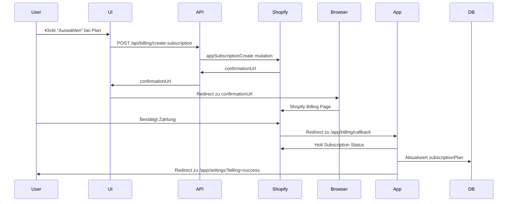
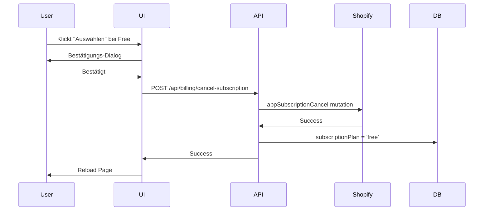
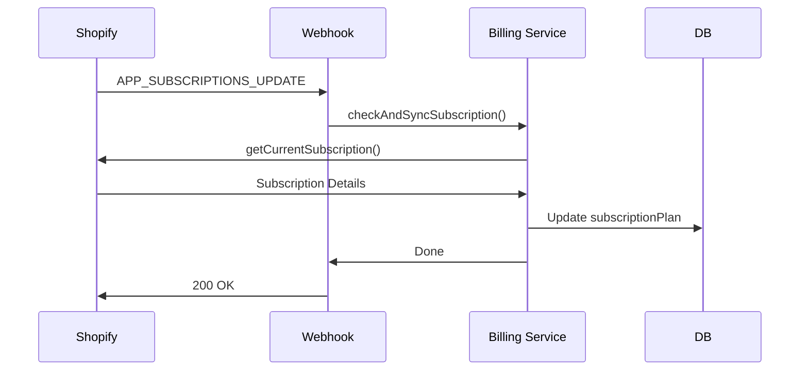

# Shopify Billing System

## Übersicht

Das Billing-System integriert Shopify's native App-Abrechnung mit 4 Plänen:

- **Free**: €0/Monat
- **Basic**: €9.90/Monat
- **Pro**: €19.90/Monat
- **Max**: €49.90/Monat

Alle bezahlten Pläne haben eine **7-tägige kostenlose Testphase**.

## Architektur

### 1. Konfiguration

**Datei**: [`app/config/billing.ts`](../app/config/billing.ts)

Definiert alle Pläne mit:
- Name
- Preis in EUR
- Abrechnungsintervall (EVERY_30_DAYS)
- Testphase (7 Tage)

```typescript
export const BILLING_PLANS: Record<Exclude<BillingPlan, 'free'>, PlanConfig> = {
  basic: {
    name: 'Basic Plan',
    price: 9.90,
    currency: 'EUR',
    interval: 'EVERY_30_DAYS',
    trialDays: 7,
  },
  // ... weitere Pläne
};
```

### 2. Billing Service

**Datei**: [`app/services/billing.server.ts`](../app/services/billing.server.ts)

Zentrale Funktionen für Abrechnung:

#### Subscription erstellen
```typescript
createSubscription(admin, session, plan, returnUrl)
```
- Erstellt ein Shopify App-Abonnement
- Gibt `confirmationUrl` zurück (Redirect für Zahlungsbestätigung)
- Im Development-Modus: `test: true` (keine echte Zahlung)

#### Subscription kündigen
```typescript
cancelSubscription(admin, subscriptionId)
```
- Kündigt aktives Abonnement
- Setzt Plan in DB auf "free"

#### Subscription Status prüfen
```typescript
getCurrentSubscription(admin)
```
- Holt aktuelles Abonnement von Shopify
- Prüft Status (ACTIVE, CANCELLED, etc.)

#### Sync zur Datenbank
```typescript
checkAndSyncSubscription(admin, shop)
```
- Gleicht Shopify Subscription mit lokaler DB ab
- Wird regelmäßig aufgerufen

### 3. API Routes

#### Subscription erstellen
**POST** `/api/billing/create-subscription`

Body:
```json
{
  "plan": "basic" | "pro" | "max"
}
```

Response:
```json
{
  "success": true,
  "confirmationUrl": "https://...",
  "subscriptionId": "gid://..."
}
```

#### Subscription kündigen
**POST** `/api/billing/cancel-subscription`

Response:
```json
{
  "success": true,
  "message": "Subscription cancelled successfully"
}
```

#### Status prüfen
**GET** `/api/billing/status`

Response:
```json
{
  "success": true,
  "plan": "basic",
  "subscription": {
    "id": "gid://...",
    "name": "Basic Plan",
    "status": "ACTIVE",
    "test": false,
    "currentPeriodEnd": "2024-02-15",
    "trialDays": 7
  }
}
```

### 4. Webhooks

**Datei**: [`app/routes/webhooks.subscription.tsx`](../app/routes/webhooks.subscription.tsx)

Handler für `APP_SUBSCRIPTIONS_UPDATE`:
- Wird von Shopify getriggert bei Änderungen
- Synchronisiert Status zur Datenbank
- Registriert in [`webhook-registration.service.ts`](../app/services/webhook-registration.service.ts)

### 5. UI

#### Billing-Seite
**Route**: `/app/billing`
**Datei**: [`app/routes/app.billing.tsx`](../app/routes/app.billing.tsx)

Features:
- Zeigt alle verfügbaren Pläne
- Zeigt aktuelles Abonnement
- Plan-Upgrade/Downgrade
- Plan-Kündigung

#### Callback nach Zahlung
**Route**: `/app/billing/callback`
**Datei**: [`app/routes/app.billing.callback.tsx`](../app/routes/app.billing.callback.tsx)

- Shopify redirected hierhin nach Zahlungsbestätigung
- Synchronisiert Subscription
- Redirected zu `/app/settings?billing=success`

## Workflow

### 1. Upgrade zu bezahltem Plan



### 2. Downgrade zu Free Plan



### 3. Subscription Update (Webhook)



## Integration mit Plan System

Das Billing-System arbeitet zusammen mit dem bestehenden [Plan System](./PLAN_SYSTEM.md):

1. **Billing bestimmt den Plan**: Shopify Subscription definiert welcher Plan aktiv ist
2. **Plan System erzwingt Limits**: Plan-Utilities prüfen Features/Limits
3. **Datenbank-Sync**: `subscriptionPlan` Feld in `AISettings` wird von Billing aktualisiert

```typescript
// Plan wird von Billing gesetzt
await syncSubscriptionToDatabase(shop, 'pro');

// Plan System nutzt diesen Wert für Limits
const canUse = canAccessContentType(plan, 'blogs'); // true für pro
const withinLimit = isWithinProductLimit(plan, 100); // true für pro (150 max)
```

## Testing

### Development Mode

In `NODE_ENV=development`:
- Alle Subscriptions haben `test: true`
- Shopify simuliert Zahlungen (keine echte Belastung)
- Subscriptions können jederzeit erstellt/gelöscht werden

### Test-Szenarien

1. **Upgrade Flow**:
   ```bash
   # 1. Gehe zu /app/billing
   # 2. Wähle "Pro Plan"
   # 3. Bestätige auf Shopify Billing Page
   # 4. Verifiziere Redirect zu /app/settings?billing=success
   # 5. Check DB: subscriptionPlan = 'pro'
   ```

2. **Downgrade Flow**:
   ```bash
   # 1. Gehe zu /app/billing
   # 2. Wähle "Free Plan"
   # 3. Bestätige Dialog
   # 4. Verifiziere Page Reload
   # 5. Check DB: subscriptionPlan = 'free'
   ```

3. **Webhook Test**:
   ```bash
   # Manuell Subscription in Shopify Admin ändern
   # Webhook sollte automatisch DB updaten
   ```

## Deployment

### API Scopes

**Gute Nachricht**: Die Shopify App Billing API benötigt **KEINE speziellen Scopes**!

Die Billing-Funktionalität (`appSubscriptionCreate`, `appSubscriptionCancel`, etc.) ist standardmäßig für alle Apps verfügbar, ohne zusätzliche Berechtigungen vom Merchant anzufordern.

> **Hinweis**: Die Scopes `read_own_subscription_contracts` und `write_own_subscription_contracts` sind nur für Apps erforderlich, die Subscription-Produkte für Merchants verwalten (wie Abo-Boxen), **NICHT** für App-Billing selbst.

### Webhook Registrierung

Webhooks werden automatisch registriert via:
```typescript
// In shopify.server.ts afterAuth hook
await shopify.registerWebhooks({ session });
```

Oder manuell:
```typescript
const webhookService = new WebhookRegistrationService(admin);
await webhookService.registerSubscriptionWebhooks();
```

### Environment Variables

Keine zusätzlichen Variablen erforderlich! Billing nutzt:
- `SHOPIFY_API_KEY`
- `SHOPIFY_API_SECRET`
- `SHOPIFY_APP_URL` (für Callback URL)

### Railway Deployment

1. **Development Environment**:
   - `NODE_ENV=development`
   - Test-Subscriptions aktiv

2. **Production Environment**:
   - `NODE_ENV=production`
   - Echte Zahlungen

## Troubleshooting

### Problem: confirmationUrl nicht erhalten

**Lösung**:
- Check `SHOPIFY_APP_URL` ist gesetzt und korrekt
- Check GraphQL Response für Fehler
- Verifiziere dass du die richtige Admin API verwendest

### Problem: Webhook nicht triggered

**Lösung**:
- Verifiziere Webhook ist registriert: `/api/webhooks/list`
- Check Shopify Admin > Settings > Notifications > Webhooks
- Check App URL ist erreichbar (nicht localhost!)

### Problem: Nach Payment keine Subscription aktiv

**Lösung**:
- Check Callback Route `/app/billing/callback` funktioniert
- Manuell sync via:
  ```typescript
  await checkAndSyncSubscription(admin, shop);
  ```

### Problem: Plan in DB stimmt nicht mit Shopify überein

**Lösung**:
- Sync manuell triggern via Status API:
  ```bash
  GET /api/billing/status
  ```
- Webhook prüfen ob registriert

## Preisänderungen

Um Preise zu ändern:

1. Update [`app/config/billing.ts`](../app/config/billing.ts):
   ```typescript
   basic: {
     name: 'Basic Plan',
     price: 12.90, // Neuer Preis
     // ...
   }
   ```

2. Bestehende Subscriptions:
   - Alte Subscriptions behalten alten Preis
   - Neue Subscriptions nutzen neuen Preis
   - Für Änderung: Subscription kündigen + neu erstellen

## Sicherheit

- ✅ Webhook-Verifizierung via Shopify HMAC
- ✅ Admin-Authentication für alle Billing APIs
- ✅ Test-Mode in Development
- ✅ Plan-Validation vor Subscription-Erstellung
- ✅ Subscription-Status Checks

## Nächste Schritte

Nach dem Deployment:

1. ☑ App deployen (keine Scope-Änderungen erforderlich!)
2. ☑ Test-Käufe in Development durchführen
3. ☑ Webhook-Delivery in Shopify Admin monitoren
4. ☑ Subscription-Flow mit echten Testern validieren
5. ☑ Dokumentation für Endnutzer erstellen
